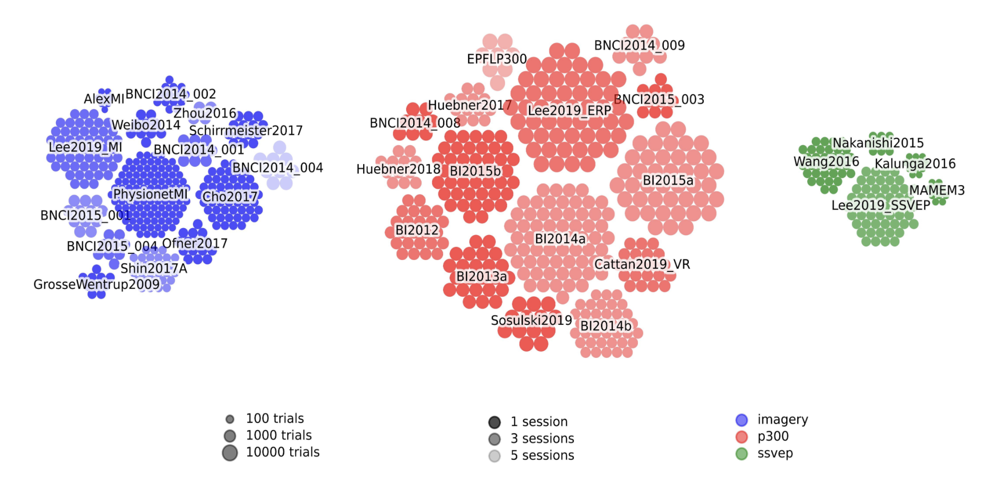

.. meta::
   :description: Browse 158 open EEG datasets for BCI research in MOABB. Filter by paradigm (Motor Imagery, P300, SSVEP, c-VEP), subject count, channels, and license. Interactive table with CSV export.
   :keywords: EEG datasets, BCI datasets, motor imagery dataset, P300 dataset, SSVEP dataset, open EEG data, brain-computer interface data

.. _data_summary:

.. automodule:: moabb.datasets

.. currentmodule:: moabb.datasets

Data Summary
======================

MOABB gathers many datasets for BCI research. Use the interactive table below to explore,
filter by paradigm, health status, country, or license, and export to CSV. Click any
dataset name for full documentation.

It is also possible to add new datasets — there is a
`tutorial <https://moabb.neurotechx.com/docs/auto_examples/tutorials/tutorial_4_adding_a_dataset.html>`__
explaining how to do so, and we welcome any new contributions!

External datasets in `BIDS <https://bids-specification.readthedocs.io/en/stable/>`__
format can also be used via
:class:`~moabb.datasets.base.LocalBIDSDataset`.

<!-- MACRO_TABLE -->

**Datasets overview:**

A visual overview of all datasets can be generated using the functions :func:`moabb.datasets.utils.plot_datasets_grid`
or :func:`moabb.datasets.utils.plot_datasets_cluster`.
This overview allows to quickly compare the number of subjects, trials, and sessions across different datasets.
The function will generate a figure like this:

Per-Paradigm Detail Tables
==========================

The tables below provide paradigm-specific details (trial counts, epoch structure, etc.)
that differ across paradigm types.

Column definitions:

- **Dataset** is the name of the dataset.
- **#Subj** is the number of subjects.
- **#Chan** is the number of EEG channels.
- **#Trials / class** is the number of repetitions performed by one subject for each class. This number is computed using only the first subject of each dataset. *The definitions of a **class** and of a **trial** depend on the paradigm used (see sections below)*.
- **Trials length** is the duration of trial in seconds.
- **Total_trials** is the total number of trials in the dataset (all subjects and classes together).
- **Freq** is the sampling frequency of the raw data.
- **#Session** is the number of sessions per subject. Different sessions are often recorded on different days.
- **#Runs** is the number of runs per session. A run is a continuous recording of the EEG data. Often, the different runs of a given session are recorded without removing the EEG cap in between.

Imagery
======================

Imagery is a BCI paradigm where the subject internally rehearses a mental
task without any overt movement or vocalization. In MOABB it covers two
sub-families that share the same ``paradigm="imagery"`` tag and the same
:class:`moabb.paradigms.MotorImagery` /
:class:`moabb.paradigms.FilterBankMotorImagery` paradigm classes:

- **Motor imagery** — imagining physical movements such as squeezing the
  left or right hand, moving the tongue, or a specific grasping task.
- **Imagined speech** — silently imagining speaking a phoneme, word, or
  phrase. See the :ref:`imagined speech subsection <imagined-speech>`
  below for a curated listing.

Imagery-specific definitions:

- **#Classes** is the number of different imagery tasks.
- **Trial** is one repetition of the imagery task.

.. csv-table::
   :file: ../build/summary_imagery.csv
   :header-rows: 1
   :class: sortable

.. _imagined-speech:

Imagined Speech (imagery family)
================================

Welcome to the **imagined speech** family, where subjects silently imagine
speaking words, phonemes, or phrases without any sound or movement.
Imagined speech is a close cousin of classical motor imagery: both rely on
internal mental rehearsal and both are decoded with similar pipelines. In
MOABB, imagined speech datasets are tagged with the ``imagery`` paradigm
and have a dedicated :class:`moabb.paradigms.SpeechImagery` class with
broadband (1-100 Hz) defaults tuned for speech, while still being
compatible with :class:`moabb.paradigms.MotorImagery` and
:class:`moabb.paradigms.FilterBankMotorImagery` if you prefer the
classic motor band.

The family currently contains
:class:`~moabb.datasets.BCIComp2020IS`,
:class:`~moabb.datasets.AguileraRodriguez2025`,
:class:`~moabb.datasets.Nguyen2017_V`, ``_S``, ``_L``, ``_SL``, and
:class:`~moabb.datasets.Pressel2016` — spanning English and Spanish,
phonemes through phrases, and 2 to 11 classes. These rows also appear
in the Imagery table above since they share the
``paradigm="imagery"`` tag.

Loading mirrors motor imagery — use :class:`~moabb.paradigms.SpeechImagery`
for the broadband 1-100 Hz defaults tuned for imagined speech, or
:class:`~moabb.paradigms.MotorImagery` if you want the classic 8-32 Hz
motor band:

.. code-block:: python

    from moabb.datasets import BCIComp2020IS
    from moabb.paradigms import SpeechImagery

    dataset = BCIComp2020IS()
    paradigm = SpeechImagery(n_classes=5)
    X, y, metadata = paradigm.get_data(dataset=dataset, subjects=[1])

.. csv-table::
   :file: ../build/summary_imagined_speech.csv
   :header-rows: 1
   :class: sortable

P300/ERP
======================

ERP (Event-Related Potential) is a BCI paradigm where the subject is presented with a stimulus and the EEG response is recorded. The P300 is a positive peak in the EEG signal that occurs around 300 ms after the stimulus.

P300-specific definitions:

- **A trial** is one flash.
- **The classes** are binary: a trial is **target** if the key on which the subject focuses is flashed and **non-target** otherwise.

.. csv-table::
   :file: ../build/summary_p300.csv
   :header-rows: 1
   :class: sortable

SSVEP
======================

SSVEP (Steady-State Visually Evoked Potential) is a BCI paradigm where the subject is presented with flickering stimuli. The EEG signal is modulated at the same frequency as the stimulus. Each stimulus is flickering at a different frequency.

SSVEP-specific definitions:

- **#Classes** is the number of different stimulation frequencies.
- **A trial** is one symbol selection. This includes multiple flashes.

.. csv-table::
   :file: ../build/summary_ssvep.csv
   :header-rows: 1
   :class: sortable

c-VEP
======================

Include neuro experiments where the participant is presented with psuedo-random noise-codes,
such as m-sequences, Gold codes, or any arbitrary "pseudo-random" code. Specifically, the
difference with SSVEP is that SSVEP presents periodic stimuli, while c-VEP presents
non-periodic stimuli. For a review of c-VEP BCI, see:

Martínez-Cagigal, V., Thielen, J., Santamaria-Vazquez, E., Pérez-Velasco, S., Desain, P.,&
Hornero, R. (2021). Brain–computer interfaces based on code-modulated visual evoked
potentials (c-VEP): A literature review. Journal of Neural Engineering, 18(6), 061002.
DOI: https://doi.org/10.1088/1741-2552/ac38cf

c-VEP-specific definitions:

- **A trial** is one symbol selection. This includes multiple flashes.
- **#Trial classes** is the number of different symbols.
- **#Epoch classes** is the number of possible intensities for the flashes  (for a visual cVEP paradigm). Typically, there are only two intensities: on and off.
- **#Epochs / class** the number of flashes per intensity in each session.
- **Codes** is the type of code used in the experiment.
- **Presentation rate** is the rate at which the codes are presented.

.. csv-table::
   :file: ../build/summary_cvep.csv
   :header-rows: 1
   :class: sortable

Resting States
======================

Include neuro experiments where the participant is not actively doing something.
For example, recoding the EEG of a subject while s/he is having the eye closed or opened
is a resting state experiment.

.. csv-table::
    :file: ../build/summary_rstate.csv
    :header-rows: 1
    :class: sortable

Compound Datasets
======================

.. automodule:: moabb.datasets.compound_dataset

.. currentmodule:: moabb.datasets.compound_dataset

Compound Datasets are datasets compounded with subjects from other datasets.
It is useful for merging different datasets (including other Compound Datasets),
select a sample of subject inside a dataset (e.g. subject with high/low performance).

.. csv-table::
   :header: Dataset, #Subj, #Original datasets
   :class: sortable

   :class:`BI2014a_Il`,17,BI2014a
   :class:`BI2014b_Il`,11,BI2014b
   :class:`BI2015a_Il`,2,BI2015a
   :class:`BI2015b_Il`,25,BI2015b
   :class:`Cattan2019_VR_Il`,4,Cattan2019_VR
   :class:`BI_Il`,59,:class:`BI2014a_Il` :class:`BI2014b_Il` :class:`BI2015a_Il` :class:`BI2015b_Il` :class:`Cattan2019_VR_Il`

Submit a new dataset
~~~~~~~~~~~~~~~~~~~~

you can submit a new dataset by mentioning it to this
`issue <https://github.com/NeuroTechX/moabb/issues/1>`__. The datasets
currently on our radar can be seen `here <https://github.com/NeuroTechX/moabb/issues/1>`__,
but we are open to any suggestion.

If you want to actively contribute to inclusion of one new dataset, you can follow also this tutorial
`tutorial <https://moabb.neurotechx.com/docs/auto_examples/tutorials/tutorial_4_adding_a_dataset.html>`__.

.. raw:: html

   
